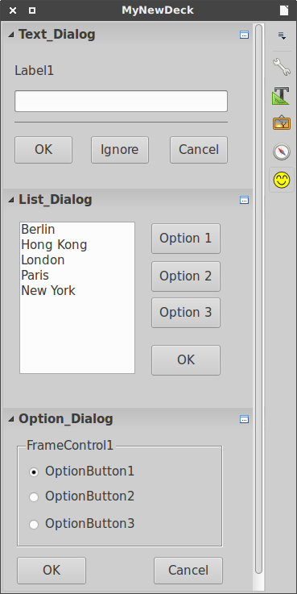
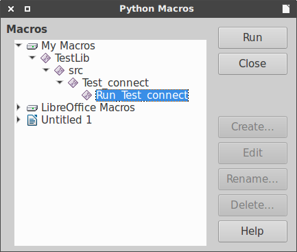
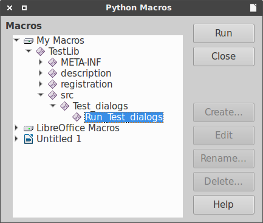

# unodit

**UNO** **Di**alog **T**ools is a Python3 command-line tool which takes a `.xdl` file written in the Basic Dialog Editor and generates dialog code in PyUNO (Python) in order to create LibreOffice extension, sidebar extension or embed in ODF documents. Unodit was developed with a focus on rapid prototyping in order to lower the barrier of entry for newcomers.
 
##Features

`unodit` main features are:

- **Convert a `.xdl` file written with Basic Dialog Editor into a PyUNO (Python):**

    `unodit` create file `MyAppName_UI.py` with actual python code. It defines a class called `MyAppName_UI` with dialog and dialog controls properties. All changes made in this file will be overwritten if the file is generated again! 

- **Allows you to customize code according to your needs:**

    In order to help you to add your own functionality to dialog `unodit` generates another file `MyAppName.py`. There is a new class `MyAppName` which extend `MyAppName_UI`. You can change dialog properties with eg. `self.DialogModel.Title = 'Hello world'` or control properties with eg.`self.TextField1.Text = "My New Text"`. Each button in your dialog is connected with action event which execute callback function `ButtonName_OnClick()`.
      
    Now you can write down the code to actually do something :)

- **Pack your code as extension, sidebar extension or embed in ODF documents:**

    After finishing coding you can decide to distribute your code. Unodit can create necessary files and generate extension or file for you. In some cases you an start extension with `Tools - AddOns - My App`.

- **Provides simple dialog boxes for interaction with a user**

    If you only want simple GUI for your macros `unodit` provides simple dialog boxes for interaction with a user. In script interactions are invoked by simple function calls. If you decide to distribute your code `nodit` can create necessary files and generate extension for you.

Other features are:
- all steps are logged to `log.log` file in project root
- per project customization with ini file (copy `config.ini` in project root)
- boilerplate code in `templates` directory
- conversion `.xdl` to `.py` defined in `schema.py`
- diff `.xdl` vs. `schema.py`

Your comments, feedback and patches are welcomed and appreciated.

NOTE:
I'm not a programmer and English is not my native language - you have been warned.
This is a project that targets LibreOffice 5+ and Python3 (Apache OpenOffice patches are welcomed).
Tested with Xubuntu 16.04. and LibreOffice 5+.

##Installation

Place the unodit directory somewhere on your Python path.

##Usage
    python3 ./unodit.py -m -d [-f ] [-a] [-p] [-i] 
    
m - mode

d - full path to the output directory (project root)

f  - full path to the xdl file

a - application name

p - number of panels in deck

i - number of spaces used for indentation in the generated code. If 0, \t is used as indent

##Quick start

This section gives a general overview, for more information see [documentation](https://github.com/kelsa-pi/unodit/wiki).

- create dialog eg. `Default.xdl` in Dialog Editor
- create project directory eg. `TestLib` in `LIBREOFFICE_PATH/4/user/Scripts/python/`
- run `unodit` to create extension in project directory
 
        python3 ./unodit.py -m 'script_all'
                            -d 'LIBREOFFICE_PATH/4/user/Scripts/python/TestLib'
                            -f 'LIBREOFFICE_PATH/4/user/basic/DialogLib/Default.xdl'
                            -a 'Test_convert'                           

- install extension using Tools - Extension Manager or command-line `/usr/bin/unopkg add ./Test_convert_Devel.oxt` (Ubuntu) 

##Screenshot

Test dialog

Pack dialogs in Sidebar

Callback function

Run macro script

Run macro connect

Run embeded macro in document

Run simple dialogs

##Unodit directory structure

    unodit/
        
        pythonpath/                    > submodules dir
            config.py                      > config file
            embed_packer.py                > embed script in ODF file
            extractor.py                   > extract context from ui file
            generator.py                   > code generator
            pyuno_generator.py             > python code generator
            schema.py                      > supported properties
            script_oxt_creator.py          > extension creator
            simple_dialogs.py              > like easygui dialogs
        
        resource/                      > resources dir
            dialogs/                       > dialog images
            screanshoot/                   > screanshoot images
        
        templates/                     > tempaltes dir
            connect/
            convert/
            dialogs/
            embeded/
            script_ext/
        
        config.ini                         > config file
        LICENSE.txt
        README.md
        unodit.py                          > main script

##Similar projects

The following is an incomplete lists of a few projects that share some similarity with `unodit`.

[Gladex](https://launchpad.net/gladex): Gladex is a Python application which takes a .glade file written in the Glade User Interface Builder and generates code in Perl, Python, or Ruby.

[pyuic4](http://pyqt.sourceforge.net/Docs/PyQt4/designer.html#the-uic-module): Convert a .ui file written with Qt Designer into a Python script.

[EasyGUI](https://sourceforge.net/projects/easygui): Very easy GUI programming in Python and Tkinter

[EasyGUI_Qt](https://github.com/aroberge/easygui_qt): Inspired by EasyGUI, designed for PyQt
